<!-- README del profilo GitHub. header.svg, split.svg e divider.svg devono stare nella root del repo, accanto a questo file. -->

<div align="center">




<br/>




</div>

## 👋 whoami

```python
class GabrieleCorti:
    role     = "IT student · final year"
    school   = "IIS Badoni — Lecco, Italy"
    writes   = ["Python", "C", "Java", "HTML", "CSS", "JavaScript"]
    designs  = ["Illustrator", "Photoshop", "Premiere Pro", "InDesign"]
    runs_on  = ["Linux", "Git", "Visual Studio Code", "JetBrains"]

    def superpower(self):
        """Most devs need a designer. Most designers need a dev.
           I ship both sides of the same screen."""
        return self.writes + self.designs
```

<div align="center"></div>

## 🚀 Currently

```diff
+ Finishing my final year at ITIS and heading toward my diploma
+ Turning school projects into things that actually run
+ Sharpening algorithms and data structures in C and java
! Future projects: IT university
! Looking for: an internship or junior role where code meets design
```

<div align="center"></div>

## ⚡ Two sides of the same screen

<div align="center">



</div>

<table width="100%">
<tr>
<td width="50%" valign="top" align="center">

### ⌨️ I BUILD IT

<br/>


<br/>

**Python · C · Java · JavaScript**

<sub>PyCharm · CLion · IntelliJ IDEA · WebStorm<br/>VS Code · Git · Linux</sub>

</td>
<td width="50%" valign="top" align="center">

### 🎨 I DESIGN IT

<br/>


&nbsp;


&nbsp;


<br/>

**Illustrator · Photoshop**
<br/>
**Premiere Pro · InDesign**

<sub>Brand and layout work, photo retouching,<br/>video editing and print-ready editorial design</sub>

</td>
</tr>
</table>

<div align="center">

> **Code without design ships ugly. Design without code stays a mockup.**
> I'd rather do both.


</div>

## 💼 Experience

> ### `▍` Software Developer — Internship
>
> **[Easynet Group](https://www.easynet.group/)** · Lecco, Italy
>
> 
> 
> 
>
> My first time writing code that someone other than a teacher would run.
> A real development team, real requirements, real code review, real deadlines —
> the part school can't simulate.
>
> **What stuck with me:** version control as a team sport, reading someone
> else's codebase before touching it, and the gap between *it works on my
> machine* and *it ships*.

<div align="center"></div>

## 📫 Let's talk

<div align="center">

<a href="mailto:gabri08.corti@gmail.com">
  
</a>
<a href="https://www.linkedin.com/in/gabriele-corti-321242303/">
  
</a>
<a href="https://instagram.com/gabriele.cortii">
  
</a>

<br/><br/>

<sub><b>Open to internships, junior roles and side projects.</b><br/>
If it needs to be built <i>and</i> look good, I'm interested.</sub>

</div>


